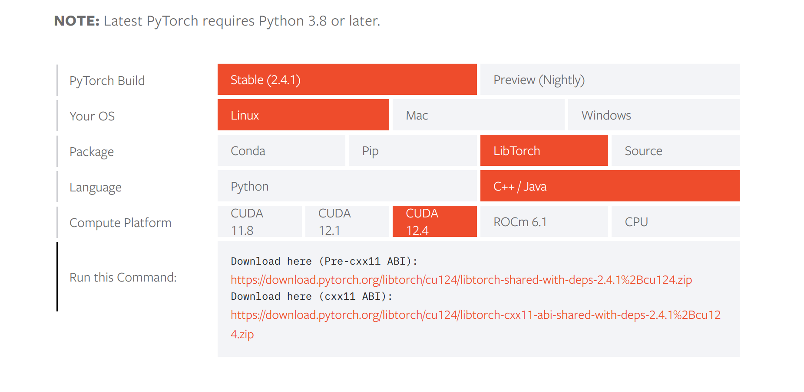

# XJTU-RMV-Task04

##  遇到的问题与改进

1. 装甲板的两个相匹配的灯条在识别过程中通过angle差异进行了第一步筛选。在识别过程中大多数情况是（leftLight.angle : 175.444 ，rightLight.angle : 178.246）这样的小差异角度，但是有时候会出现（leftLight.angle : 177.711，rightLight.angle : 0.18965）这样的情况。所以对angle_gap的这个特殊情况进行了筛选。

2. 对于两个相匹配的灯条的外可能会有第三个灯条的angle的识别值与这两个的差异较小，这个是小概率事件。如果因为这个一两帧的错误对angle_gap的筛选范围进一步缩小，会导致正常识别的装甲板受到影响。也考虑过对于装甲板的灯条角度的gap进行择优选取绘制矩形，但是这在装甲板旋转时，会导致每一帧只能识别一个装甲板灯条的情况。

3. 尝试用MNIST数据集训练的模型，部署到opencv任务中。但是在安装libtorch时，下载错了libtorch的版本，折腾半天。(T-T) 

   不知道这两个的区别是啥意思，但是下载下面的Download here (cxx11 ABI):就行了

   

4. 对于装甲板数字的识别，我的想法是先截取装甲板数字区域。本来觉得截取这个区域没有必要完全按照识别到的装甲板的角度来截取，只要截取的image里面有数字不就行了。但是后续在换低曝光的视频时，由于截取区域会有灯条包括在内，所以会导致模型识别的时候注意到灯条，而忽略了亮度低不明显的数字。所以这里我有两个想法来解决问题：

   - 把截取图像的灯条颜色过滤掉，反正就是要通过操作降低或者抹去灯条的亮度干扰。
   - 直接根据识别到的装甲板的角度来截取图像，这样就会避免把灯条也截取进所需的装甲板数字的图像

   最后我选择了第一种方法解决，因为简单方便一点，而且效果也还不错

5. 
